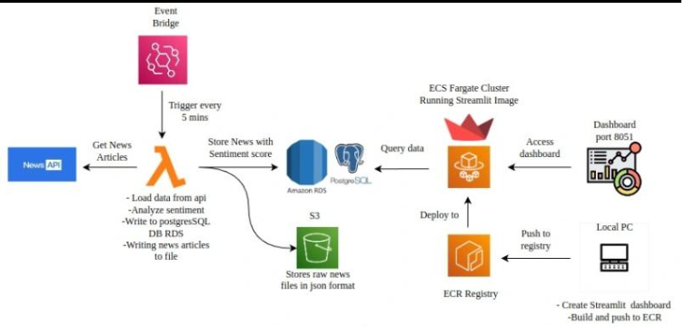

# 📰 Cloud-Native News Sentiment Dashboard

This project automates real-time news sentiment analysis using AWS services and visualizes the results through a Streamlit dashboard hosted on ECS Fargate.

## 🔧 Technologies Used

- AWS Lambda  
- Amazon EventBridge  
- Amazon S3  
- Amazon RDS (PostgreSQL)  
- Docker & Amazon ECR  
- Amazon ECS (Fargate)  
- Streamlit  
- TextBlob (for sentiment analysis)

## 🔄 Data Pipeline Flow

1. **AWS EventBridge** triggers Lambda every 5 minutes.
2. **Lambda** fetches U.S. news headlines from the News API.
3. Performs **sentiment analysis** using `TextBlob`.
4. Stores raw JSON in **Amazon S3**.
5. Stores cleaned, labeled data in **Amazon RDS (PostgreSQL)**.
6. A **Streamlit dashboard**, containerized using Docker, fetches sentiment data from RDS.
7. Docker image is pushed to **Amazon ECR** and deployed to **ECS Fargate**.
8. Dashboard is accessible through a **public IP**.

---

## 🧠 Sentiment Score Interpretation

Sentiment is calculated using TextBlob's polarity:

- Positive: `score > 0.1`  
- Neutral: `-0.1 ≤ score ≤ 0.1`  
- Negative: `score < -0.1`

Example Output:

| Headline                                | Sentiment Score | Label     |
|-----------------------------------------|------------------|-----------|
| "Stock market rebounds sharply"         | 0.76             | Positive  |
| "Inflation remains flat"                | 0.04             | Neutral   |
| "Violence erupts in capital"            | -0.62            | Negative  |

---


## 📂 Project Files

- [lambdacode.py](lambdacode.py) — Fetches news from the News API and saves data to both S3 and RDS.
- [streamlit.py](streamlit.py) — Streamlit dashboard code that reads from RDS and displays sentiment data.
- [dockerfile](dockerfile) —  Builds the Docker image for the Streamlit app.
- [requirement.txt](requirement.txt) — This requirements.txt file lists the Python packages


## ⚙️ Setup Instructions

# 🔹 1. Lambda Functions

- **Lambda 1 (Raw Ingestor)**:
  - Fetches articles from NewsAPI.
  - Saves raw JSON data to S3.

- **Lambda 2 (Processor)**:
  - Reads from S3.
  - Cleans and analyzes sentiment.
  - Inserts records into RDS PostgreSQL.

# 🔹 2. PostgreSQL on RDS

- Create an RDS PostgreSQL instance.
- Note the **endpoint**, **username**, and **password**.
- Use SQL commands via Python (psycopg2) to create tables inside Lambda.

# 🔹 3. Sentiment Analysis

- Performed in Lambda using `TextBlob`.
- Sentiment classification based on polarity:
  - Positive: `> 0.1`
  - Neutral: `-0.1 ≤ score ≤ 0.1`
  - Negative: `< -0.1`

# 🔹 4. Streamlit Dashboard

- Read data from RDS using `psycopg2` or `SQLAlchemy`.
- Display:
  - News headlines
  - Sentiment labels
  - Pie/Bar charts
  - Date filters

# 🔹 5. Dockerization

- Build Docker image:

  ```bash
  docker build -t streamlit-news-dashboard .
  
- Run locally to test:

  ```bash
  docker run -p port:port streamlit-news-dashboard

# 🔹 6. ECR + ECS Fargate
  
    --Push to ECR:
    
    aws ecr create-repository --repository-name streamlit-news
    
    docker tag streamlit-news:latest <your-ecr-uri>
    
    docker push <your-ecr-uri>
    
    --Deploying to ECS Fargate
      
    To ensure scalability and seamless hosting, we deploy our Streamlit-based dashboard using Amazon ECS Fargate. This serverless container service eliminates the need to manage servers and 
    simplifies deployment.
      
      🚀 Deployment Steps:
      
      ✅ Create an ECS Task Definition using the Docker image pushed to Amazon ECR.
      
      ✅ Set up an ECS Service using Fargate within a public subnet.
      
      ✅ Map your custom port (e.g., 8501) to allow external access to the application.
      
      ✅ Access the dashboard via the public IP address assigned by ECS.


# 📊 Dashboard Preview
  
  Displays live headlines and sentiment.
  
  Uses real-time data from RDS.
  
  Accessible via browser (ECS public IP).
  
  Sentiment categories are color-coded for quick visual interpretation:
     🔴 Negative (Red), 🟢 Neutral (Green), 🔵 Positive (Blue).

 [Dashboard](dashboard.png) :This dashboard offers a dynamic and user-friendly interface for analyzing news trends, and it's fully accessible from anywhere via the public IP of the deployed 
 ECS service.


## 🛡️ Security Notes

Never expose AWS credentials or API keys in public repositories.
Use Secrets Manager, Lambda environment variables, or parameter store for sensitive data.
Lock down RDS and S3 access using IAM roles and security groups.


## 📐 Architecture Diagram




# ✅ Conclusion

This project demonstrates how to build a cloud-native, serverless, and containerized sentiment analysis pipeline using AWS. It combines automated data ingestion, NLP-based transformation, and intuitive visualization through Streamlit on ECS. This architecture is highly scalable, cost-efficient, and suited for real-time analytics workloads.


